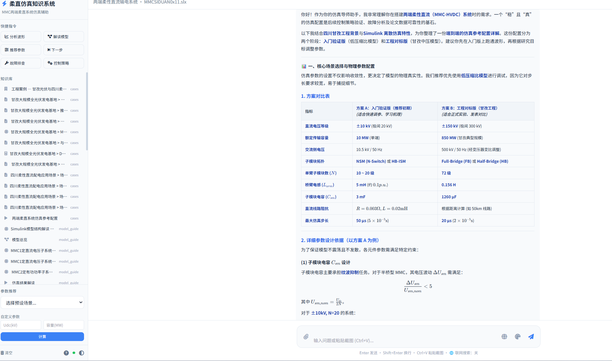
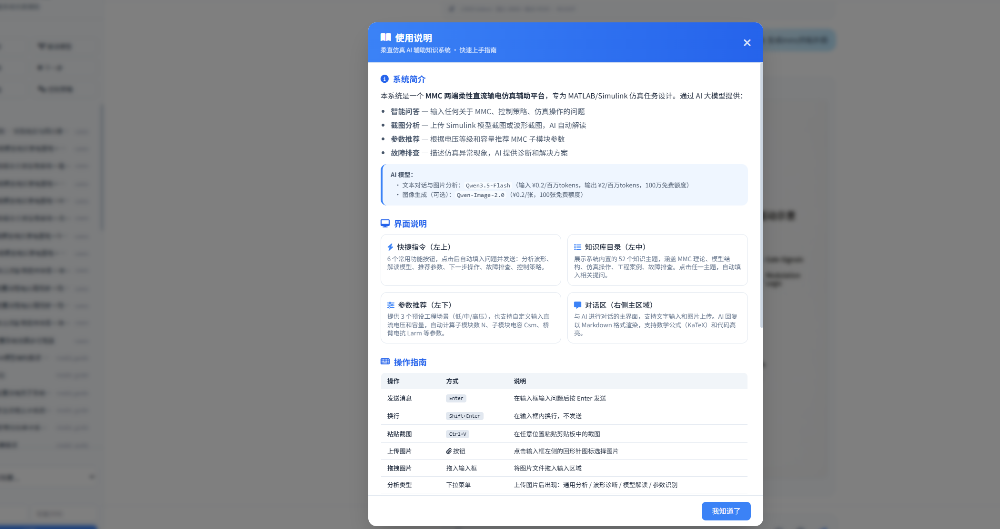

# 柔直仿真 AI 辅助知识系统 (FDC Knowledge System)

MMC 两端柔性直流输电系统仿真辅助平台，基于 MATLAB/Simulink 模型，提供 AI 智能问答、截图分析、参数推荐、图像生成等功能。





## 功能特性

- **智能问答** — 基于 Qwen3.5-Flash 大模型，支持柔直仿真相关问答
- **截图分析** — 上传 Simulink 模型/波形截图，AI 自动解读诊断
- **参数推荐** — 3 个预设工程场景 + 自定义 MMC 参数计算
- **知识库** — 52 个知识主题（理论/模型/仿真/案例/故障），TF-IDF 检索自动匹配
- **联网搜索** — 可选开关，结合互联网信息回答
- **图像生成** — Qwen-Image-2.0 生成参考示意图（可选）
- **费用追踪** — 实时 token 消耗统计 + 预算进度条

## 快速启动

```bash
cd fdc-knowledge-system

# 方式一: 启动脚本（推荐）
start.bat

# 方式二: 手动启动
set DASHSCOPE_API_KEY=你的API_Key
pip install -r requirements.txt
python main.py
```

浏览器访问 http://localhost:8080

## 技术栈

| 组件 | 技术 |
|------|------|
| 后端 | Python FastAPI + SSE 流式响应 |
| 前端 | 单页 HTML + TailwindCSS + vanilla JS |
| AI 对话/视觉 | Qwen3.5-Flash（¥0.2/百万输入tokens，¥2/百万输出tokens） |
| AI 图像生成 | Qwen-Image-2.0（¥0.2/张） |
| 数学公式 | KaTeX |
| 知识检索 | 纯 Python TF-IDF |

## API 端点

| 端点 | 方法 | 功能 |
|------|------|------|
| `/api/chat` | POST | SSE 流式文本对话 |
| `/api/analyze-image` | POST | SSE 流式图像分析 |
| `/api/generate-image` | POST | AI 图像生成 |
| `/api/knowledge/topics` | GET | 知识库主题列表 |
| `/api/knowledge/search?q=` | GET | 知识检索 |
| `/api/params/scenarios` | GET | 预设场景列表 |
| `/api/params/{id}` | GET | 场景参数 |
| `/api/params/custom` | POST | 自定义参数计算 |
| `/api/status` | GET | 系统状态 |

## 目录结构

```
fdc-knowledge-system/
├── main.py              # FastAPI 主入口
├── config.py            # 配置（API Key、模型、提示词、计费）
├── requirements.txt     # Python 依赖
├── start.bat            # Windows 启动脚本
├── services/
│   ├── qwen_client.py   # Qwen API 客户端（文本+图像+图像生成）
│   ├── knowledge_base.py # TF-IDF 知识库检索
│   ├── param_advisor.py  # MMC 参数推荐引擎
│   └── matlab_bridge.py  # MATLAB Engine 接口（预留）
├── knowledge/            # 知识库 Markdown 文件
│   ├── theory.md         # MMC/VSC 理论
│   ├── model_guide.md    # 模型结构解读
│   ├── simulation_ops.md # 仿真操作指南
│   ├── cases.md          # 工程案例
│   └── troubleshoot.md   # 故障排查
└── static/
    └── index.html        # 前端页面
```
